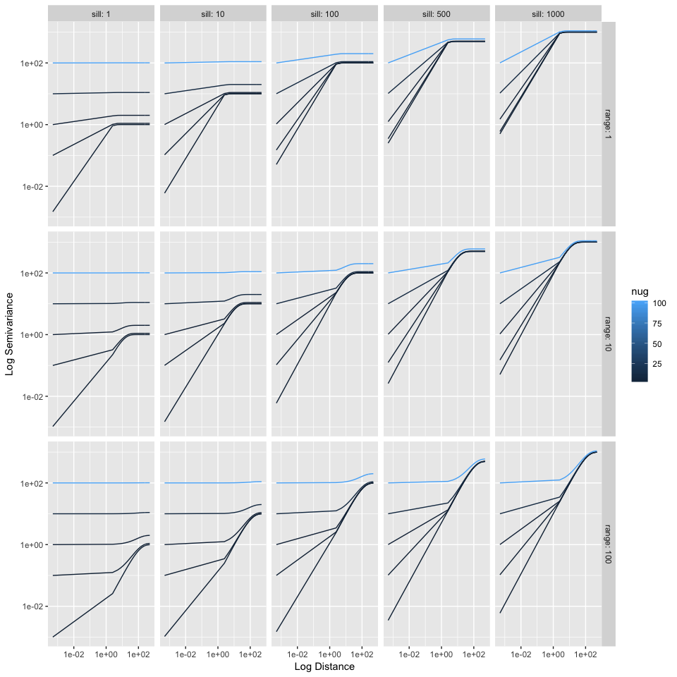
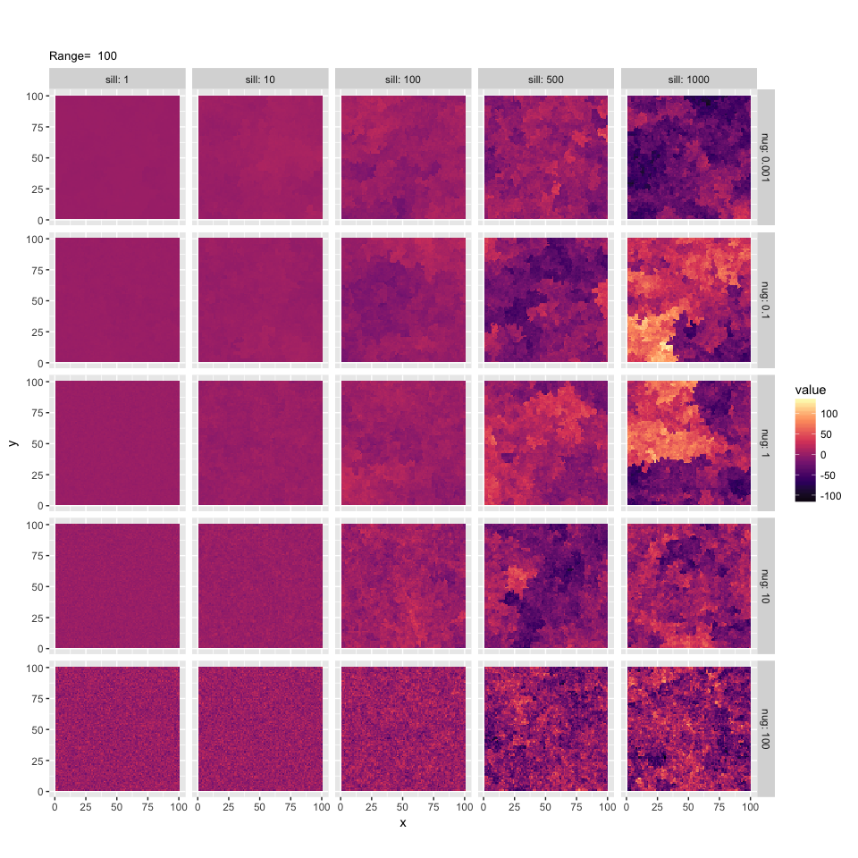
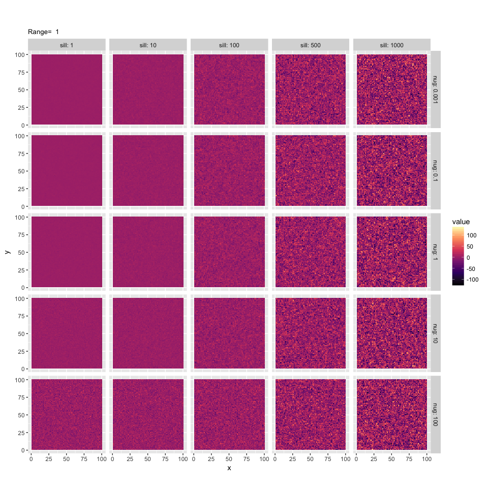

```r
knitr::opts_chunk$set(cache=T)
library(gstat)
library(ggplot2)
library(tidyr)
library(foreach)
library(gridExtra)
library(ggpubr)
library(dplyr)
library(doParallel)
registerDoParallel()
```

# Data Generation

## Generate landscape

```r
xy <- expand.grid(1:100, 1:100)
names(xy) <- c('x','y')
```

## Select parameters to consider
`expand.grid()` will generate all possible combinations of the options below

```r
parameters=expand.grid(
  nug=c(0.001,0.1,1,10,100),
  sill=c(1,10,100,500,1000),
  range=c(1,10,100))
nsim=10  # number of realizations of each simulation to generate
```


## Simulate the landscapes

This section can be editied to create many kinds of landscapes (and not just from a variogram)

```r
res=foreach(i=1:nrow(parameters),.combine=rbind.data.frame) %dopar%{
  print(i)
  parms=parameters[i,]
  # Specify the the spatial model - can edit for different types of models 
  spatial_model=vgm(
    nugget = parms$nug, 
    psill=parms$sill, 
    range=parms$range, 
    model='Exp')
  # Create the 'model'
  g.dummy <- gstat(formula=z~1, locations=~x+y, dummy=T, beta=1, 
                   model=spatial_model, nmax=1)
  # Make the surfaces and tidy them up
  pred <- cbind.data.frame(parms,
                           predict(g.dummy, newdata=xy, nsim=nsim)%>%
                             gather(sim,value,-x,-y))
  return(pred)
}
```

Then we can compare how the various metrics describe the variability.  I'm not thinking of trying to 'recover' the variogram parameters per se (the best way to do that would be a proper spatial model) - more to be able to say things like "TPI is very sensitive to the small scale variation (e.g. nugget), while some other metric is not" or similar  Having the 'truth' of the landscape allows statements like that.

Disadvantages: the landscapes are artifical (though not more artifical than the checkerboard, etc.). I've thought about applying some sort of post-processing to 'erode' the landscape into something that looks more natural but haven't taken this idea very far.


## Plot Simulated landscapes


```r
ps=foreach(r=unique(parameters$range))%dopar%{
# Filter to only show one realization for each model
    pt=filter(res,range==r,sim=="sim1")%>%
    ggplot(aes(x=x,y=y,fill=value))+
    geom_tile()+
    facet_grid(nug~sill,labeller = label_both)+
    scale_fill_viridis_c(option="magma")+
    coord_equal()+
    ggtitle(label="",subtitle = paste("Range= ",r))
  return(pt)
}

ggarrange(plotlist=ps,ncol=1,align="v")
```

<!-- --><!-- --><!-- -->


## Simulate patchy landscape

Can threshold the continuous values to generate discrete patches if desired.  The rows in the figure below are 10 realizations of the same process.  


```r
filter(res,range==100,sill==1000)%>%
    mutate(categorical=
             cut(value,
                 quantile(value,
                          c(0,0.333,0.666,1)),
                          labels=1:3),na.rm=T)%>%
    ggplot(aes(x=x,y=y,fill=categorical))+
    geom_tile()+
    facet_grid(sim~nug,labeller = label_both)+
    scale_fill_viridis_d(option="magma")+
    coord_equal()
```

<!-- -->

